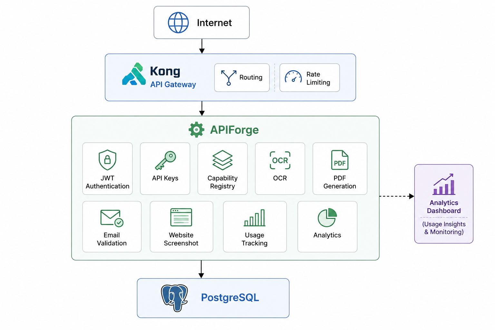

# APIForge


APIForge is an end-to-end API Platform MVP built with **FastAPI**, **PostgreSQL**, and **Kong API Gateway**.

It enables developers to:

* Sign up and authenticate with JWT
* Generate and manage API Keys
* Discover available capabilities
* Consume APIs securely using API Keys
* Track API usage
* View analytics
* Access APIs through Kong API Gateway with rate limiting

---

## Quick Start

Clone the repository:

```bash
git clone <repo-url>

cd APIForge
```

Start all services:

```bash
docker compose up --build -d
```

Available Services:

| Service    | URL                        |
| ---------- | -------------------------- |
| FastAPI    | http://localhost:8000      |
| Swagger UI | http://localhost:8000/docs |
| Kong Proxy | http://localhost:8080      |
| Kong Admin | http://localhost:8001      |

---

## Architecture

<p align="center">
  
</p>

---

## Tech Stack

| Layer              | Technology                  |
| ------------------ | --------------------------- |
| Backend            | FastAPI                     |
| Database           | PostgreSQL                  |
| ORM                | Async SQLAlchemy 2.0        |
| Authentication     | JWT                         |
| API Keys           | SHA256 Hashed Keys          |
| API Gateway        | Kong 3.8                    |
| Containerization   | Docker Compose              |
| OCR                | Tesseract OCR               |
| PDF Generation     | ReportLab                   |
| Email Validation   | email-validator + dnspython |
| Website Screenshot | Playwright                  |

---

## Features

### Authentication

* User Signup
* User Login
* JWT Authentication
* Current User API

### API Key Management

* Generate API Keys
* List API Keys
* Revoke API Keys
* SHA256 Key Hashing

### Capability Registry

* Capability Registration
* Capability Discovery
* Capability Activation / Deactivation

### Available Capabilities

* OCR API
* PDF Generation API
* Email Validation API
* Website Screenshot API

### Platform Features

* API Key Authentication
* Usage Tracking Middleware
* Analytics APIs
* Kong API Gateway
* Gateway-Level Rate Limiting

---

## Security

* JWT authentication for management APIs
* API Key authentication for capability APIs
* SHA256 hashing for API Keys
* Kong Gateway rate limiting
* SSRF protection for Website Screenshot API

---

## Project Structure

```text
APIForge/

.devcontainer/

services/

├── apiforge/

│   ├── app/

│   │   ├── auth/

│   │   ├── api_keys/

│   │   ├── capabilities/

│   │   ├── ocr/

│   │   ├── pdf/

│   │   ├── email_validation/

│   │   ├── screenshot/

│   │   ├── usage/

│   │   ├── analytics/

│   │   ├── core/

│   │   ├── db/

│   │   └── models/

│   │

│   ├── Dockerfile

│   └── requirements.txt

│

└── kong/

    └── kong.yml


docker-compose.yml
```

---


APIForge is a complete API Platform MVP featuring JWT authentication, API keys, capability discovery, OCR, PDF generation, email validation, website screenshots, analytics, and Kong API Gateway integration.
